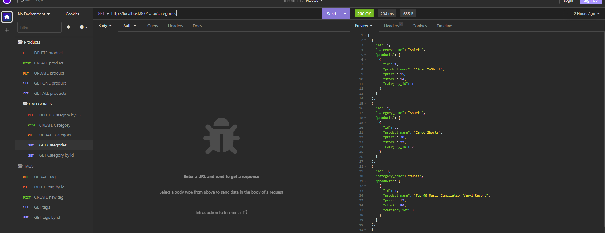
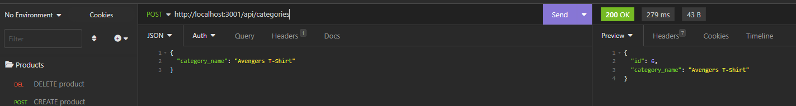

# Challenge13-E-Commerce_BackEnd

## Decsription
The task is to build the back end for an e-commerce site by modifying starter code. You’ll configure a working Express.js API to use Sequelize to interact with a MySQL database.

## User Story

```md
AS A manager at an internet retail company
I WANT a back end for my e-commerce website that uses the latest technologies
SO THAT my company can compete with other e-commerce companies
```

## Acceptance Criteria

```md
GIVEN a functional Express.js API
WHEN I add my database name, MySQL username, and MySQL password to an environment variable file
THEN I am able to connect to a database using Sequelize
WHEN I enter schema and seed commands
THEN a development database is created and is seeded with test data
WHEN I enter the command to invoke the application
THEN my server is started and the Sequelize models are synced to the MySQL database
WHEN I open API GET routes in Insomnia for categories, products, or tags
THEN the data for each of these routes is displayed in a formatted JSON
WHEN I test API POST, PUT, and DELETE routes in Insomnia
THEN I am able to successfully create, update, and delete data in my database
```
## Usage
[Github Page Address](https://github.com/TonyWorldChanger/Challenge13-E-Commerce_BackEnd)

You will need to run the schema from the data base file. You will need to log into your mysql and source the schema. Next, use the command "npm run seed" to seed the data. After you seed the data, you will need to use the command "npm start", this will allow you to connect to the server. Open Insomnia and have some fun!!!!

### ScreenShot of Challenge



### Video Link
https://watch.screencastify.com/v/n9G7yJV6atVazt0lgxmj


## Credits
Kevin YouTube Channel
Cameron Verver TA
Sean - Sub Instructor